# 🎧 프로젝트명: SoundStore

> 특별한 사운드를 유저들과 공유하고 찾을 수 있는 공간
> 노래, 효과음, 배경음 기타 등등의 대한 사운드들의 정보를 공유하는 공간입니다!

---

## 🧠 개발 배경

> 원하는 느낌의 효과음을 찾기 어렵거나 라이선스 문제로 영상에서 사용 가능한 소리가 제한적이라
> 문제 없는 사운드를 여러 사이트를 통해서 찾는 등 다양한 사운드를 사용하는 데에 불편함이 많이 발생합니다.
> 
> 이러한 문제점들을 해결할 방법으로 사운드를 공유하고 업로드하는 "사운드 스토어" 콘솔 프로그램 프로젝트를 진행하게 되었습니다

---

## ⚙️ 프로젝트 개발 환경

- Java 17
- Eclipse
- Windows 10

---

## 💻 프로젝트 실행 환경

- JDK 17 이상
- 콘솔 환경 (CLI 기반)
- 실행 파일: `SoundStoreMain.jar` or `SoundStoreMain.java`

## 🔍 요구사항 졍의서, 명세서
[요구사항 정의서, 명세서 원본](https://docs.google.com/spreadsheets/d/1eLR46TsCTyzi2-oHuJ4Jh1tjbZ6jeBRgaJTdUylKOZY/edit?usp=sharing)

### 요구사항 정의
> 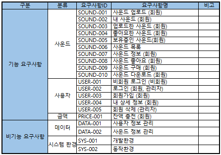

### 요구사항 명세서
#### 1. 기능 요구사항
> ##### 사운드 (SOUND)
> 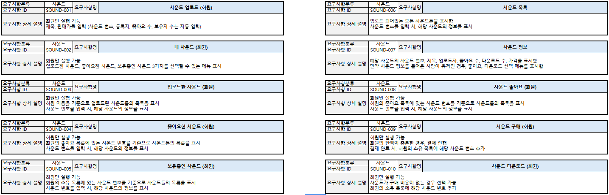

> ##### 유저 (USER)
> 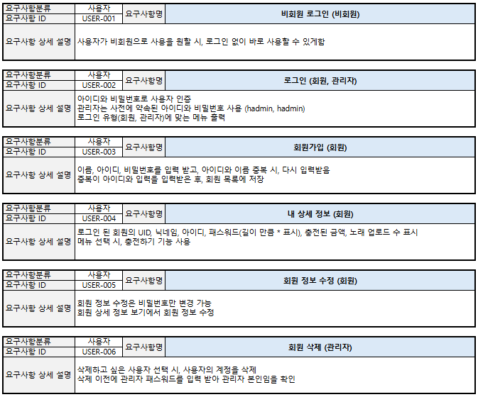

> ##### 금액 (PRICE)
> 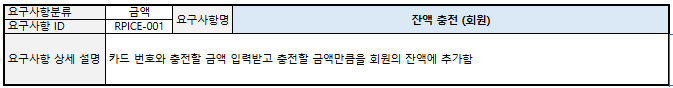

#### 2. 비기능 요구사항

> ##### 데이터 (DATA)
> 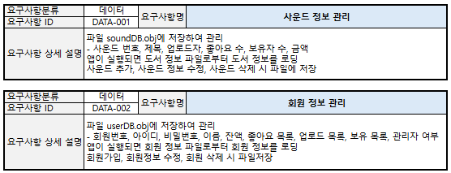

> ##### 시스템 환경 (SYSTEM)
> 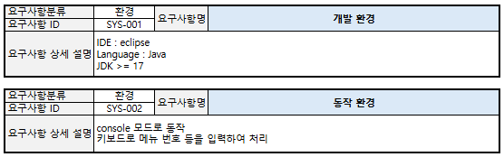
---

## ✨ 주요 기능

- [x] 사운드 업로드
- [x] 내 사운드 보기 (업로드한 사운드, 좋아요한 사운드, 보유중인 사운드)
- [x] 사운드 목록 보기
- [x] 사운드 좋아요/구매/다운로드

---

## ⚙ 유스케이스 다이어그램
> 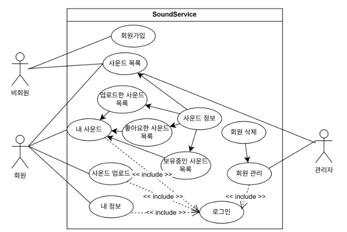

## 🎬 작동 시나리오

> 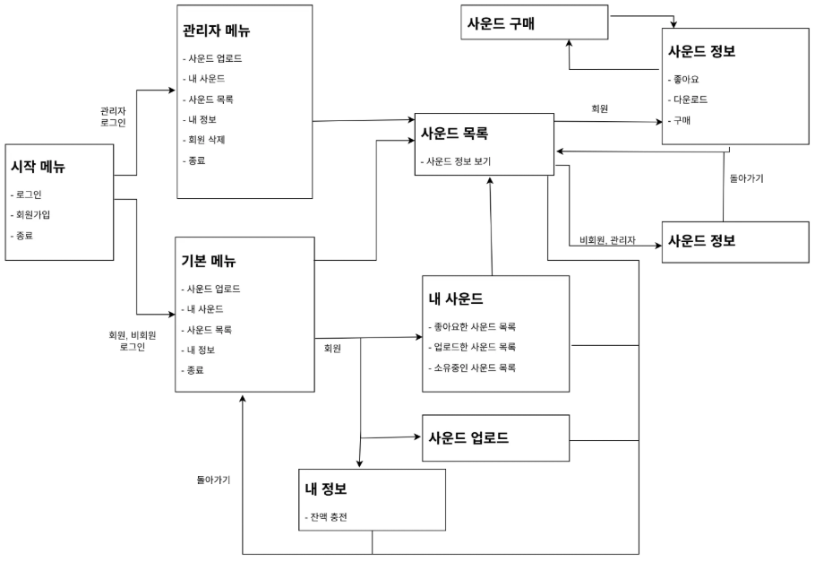

---

## 🗂️ 프로젝트 구조

<pre>
📦 src
 ┣ 📁 app
 ┃ ┣ 📄 SoundStoreApp.java
 ┃ ┗ 📄 SoundStoreMain.java
 ┣ 📁 sound
 ┃ ┣ 📄 HashMapSoundDAO.java
 ┃ ┣ 📄 SoundDAO.java
 ┃ ┣ 📄 SoundService.java
 ┃ ┣ 📄 SoundVO.java
 ┃ ┣ 📄 YJSoundService.java
 ┃ ┗ 📁 file
 ┃   ┣ 📄 FileSoundDB.java
 ┃   ┗ 📄 ObjFileHashMapSoundDAO.java
 ┣ 📁 user
 ┃ ┣ 📄 HashMapUserDAO.java
 ┃ ┣ 📄 UserDAO.java
 ┃ ┣ 📄 UserService.java
 ┃ ┣ 📄 UserVO.java
 ┃ ┣ 📄 YJUserService.java
 ┃ ┗ 📁 file
 ┃   ┣ 📄 FileUserDB.java
 ┃   ┗ 📄 ObjFileHashMapUserDAO.java
</pre>

## 🧭 클래스 다이어그램

> ### 📁 sound 패키지  
> 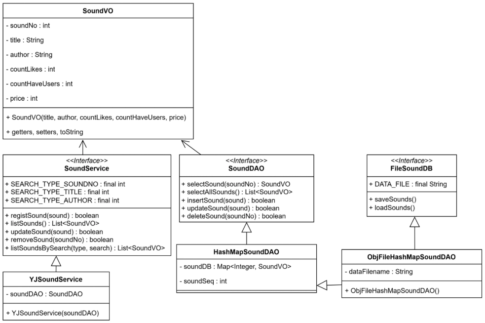

> ### 📁 user 패키지  
> 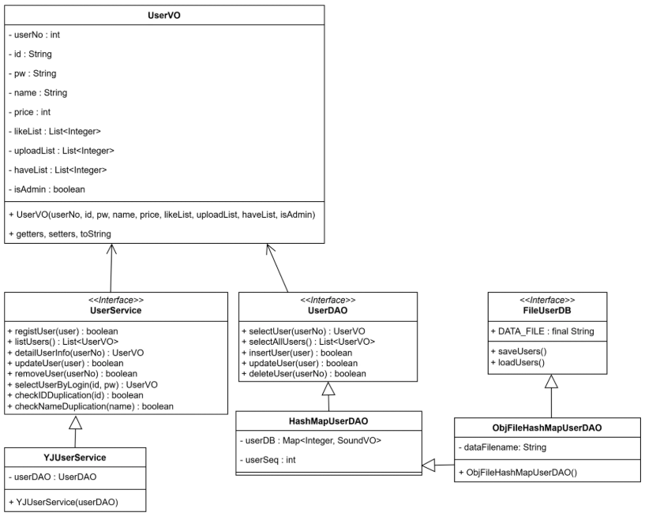

> ### 📁 app 패키지  
> 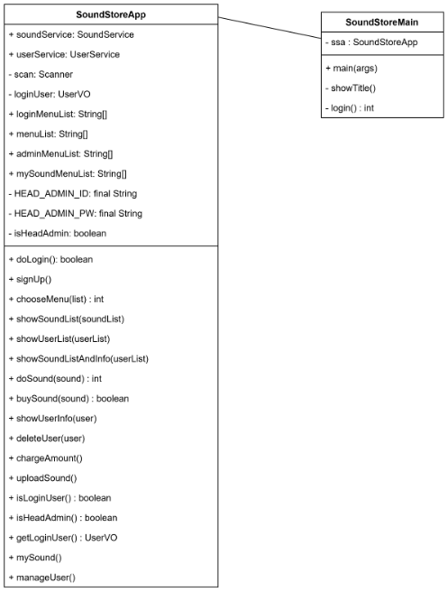

---

## 📑 코드 리뷰

> 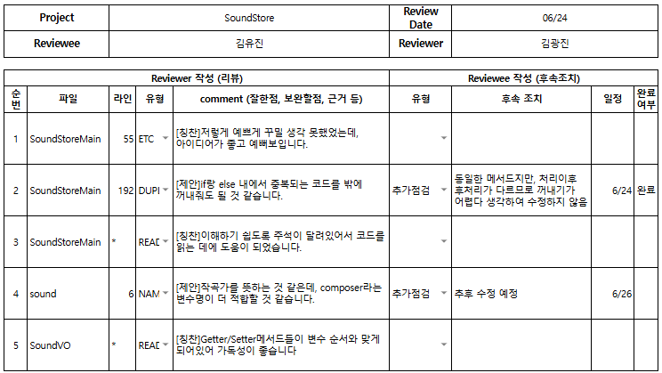

> 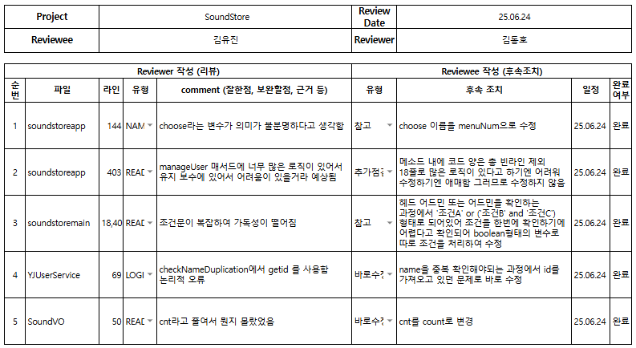

> 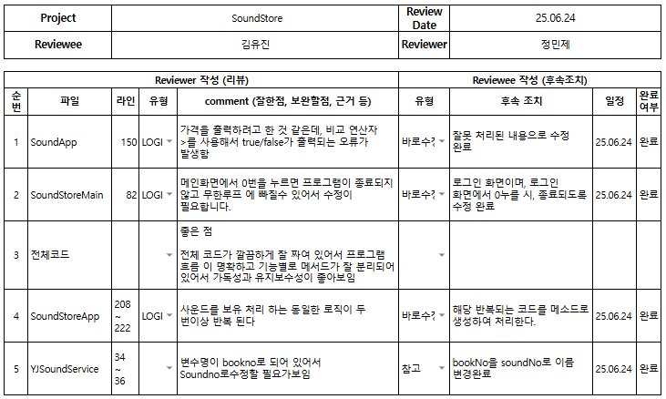

## 시연 영상
### 사용자 시점 시연
[시연 영상](https://www.youtube.com/watch?v=NEphpE_5sUg)

### 관리자 시점 시연
[시연 영상](https://www.youtube.com/watch?v=hyDJbIjmpTA)
